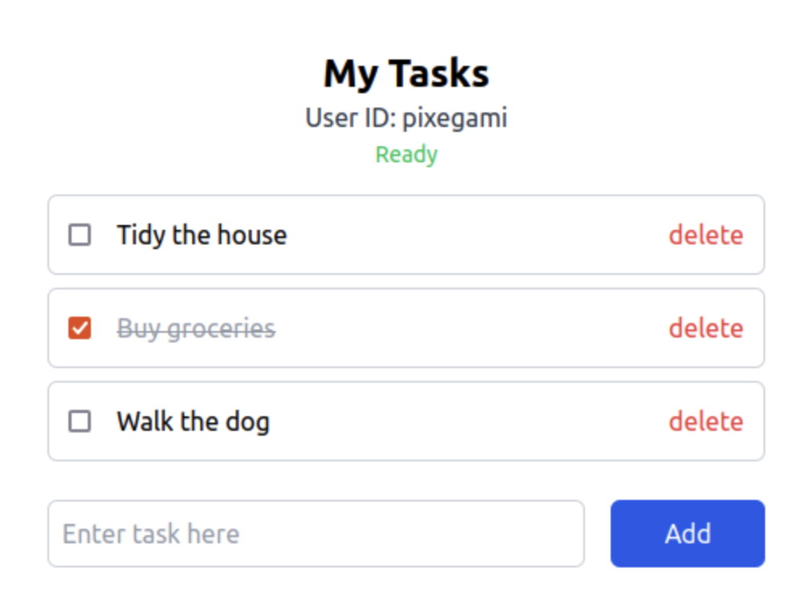
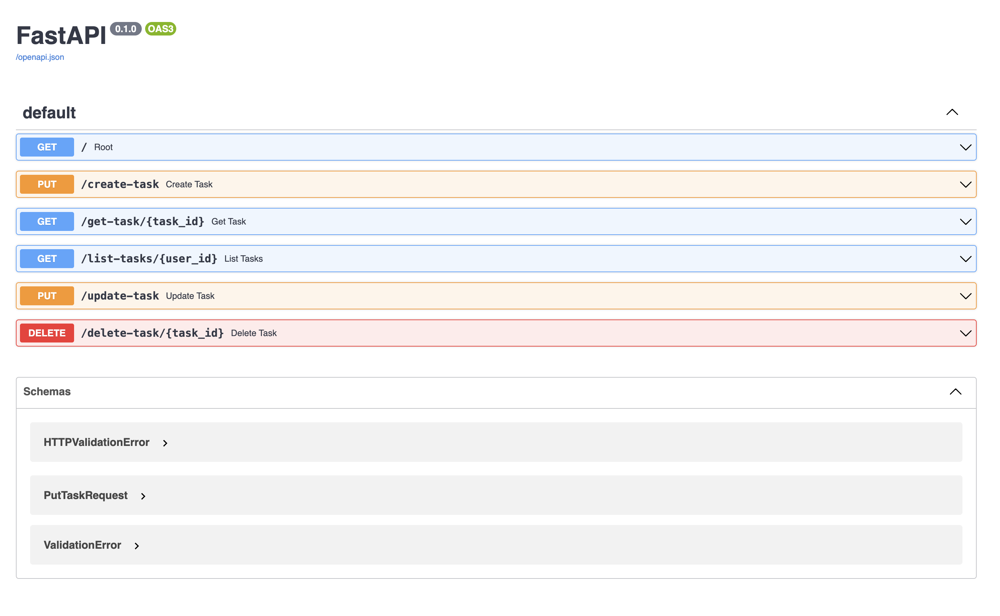

# REST API Integration Testing with Python

API testing project with python, pytest and request and uuid for data.

Validation of CRUD operations for API end poing: https://todo.pixegami.io/

## Installing pre requisites

* PyTest: https://docs.pytest.org
* Request: https://requests.readthedocs.io

## API Documentation

https://todo.pixegami.io/docs

## Run test

To run the test in terminal enter the command: pytest test_endpoint.py and/or pytest test_endpointV2.py

### Additional pytest Options

* Verbose Output: You can add the -v flag to get more detailed output.

pytest -v test_endpointV2.py

* Show Print Statements: If you want to see the print statements in the terminal, use the -s flag.

pytest -s test_endpointV2.py

* Run Specific Test: If you only want to run a specific test function, you can specify it using the :: syntax.

pytest test_endpointV2.py::test_can_create_task

